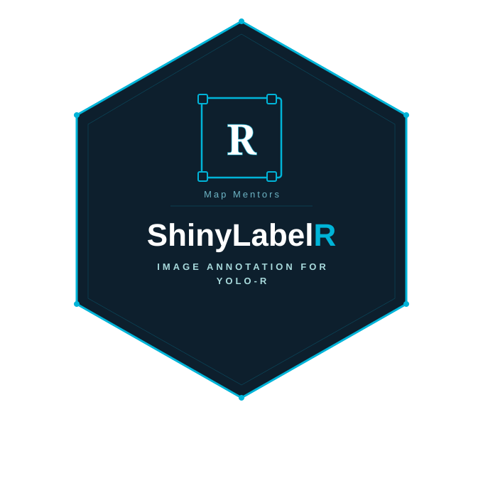

# ShinyLabelR

**A browser-based image annotation tool built in R with Shiny. Label images, manage teams, and export datasets in YOLO and COCO JSON format — no Python required.**

<p align="center">
  
</p>

## What it does

- Draw bounding boxes directly in the browser
- Manage annotation classes with custom colors
- Invite teammates via one-time invite codes
- See who annotated what on the Dashboard
- Export to **YOLO Ultralytics** format (train/val split + data.yaml)
- Export to **COCO JSON** (Detectron2, MMDetection compatible)
- Persistent storage via **Supabase** — works on shinyapps.io

---

## Installation

```r
# Install from GitHub
devtools::install_github("Lalitgis/ShinyLabelR")
```

---

## Setup (Supabase)

ShinyLabelR uses [Supabase](https://supabase.com) as its database so that
annotations persist across sessions and multiple teammates can collaborate
in real time. Supabase is free for this use case.

### Step 1 — Create a Supabase project

1. Go to [supabase.com](https://supabase.com) and sign up (free)
2. Click **New project**, give it a name, choose a region close to you
3. Wait ~2 minutes for the project to provision

### Step 2 — Run the schema

1. In your Supabase dashboard go to **SQL Editor → New Query**
2. Open [`inst/sql/schema.sql`](inst/sql/schema.sql) from this repo
3. Paste the contents into the editor and click **Run**

This creates the five tables the app needs:
`users`, `invite_codes`, `images`, `classes`, `annotations`.

### Step 3 — Get your API credentials

In your Supabase project go to **Settings → API** and copy:

| Variable | Where to find it |
|---|---|
| `SUPABASE_URL` | Project URL — looks like `https://xyzxyz.supabase.co` |
| `SUPABASE_KEY` | `anon` / `public` key |

### Step 4 — Set environment variables

**On shinyapps.io:**
Dashboard → your app → **Settings → Environment Variables** → add both keys.

**Running locally:**
```r
Sys.setenv(
  SUPABASE_URL = "https://yourprojectid.supabase.co",
  SUPABASE_KEY = "your-anon-public-key"
)
```

Or add them to your `.Renviron` file so they load automatically:
```
SUPABASE_URL=https://yourprojectid.supabase.co
SUPABASE_KEY=your-anon-public-key
```

### Step 5 — Launch

```r
library(ShinyLabelR)
run_shinylabel()
```

---

## Team Access

ShinyLabelR uses an **invite code system** — no email service required.

### First user = Admin (automatic)

The very first person to open the app and register becomes the **Admin**
automatically. No invite code needed. Admins can invite teammates, remove
members, and export datasets.

### Inviting teammates

1. Admin opens the app → **Team tab → Generate Invite Code**
2. A code like `ANT-4829` appears — copy and share it via Slack, WhatsApp, or email
3. Codes are valid for **72 hours** and can only be used **once**
4. Teammate opens the app → clicks **Join with an invite code** → enters their
   name, email, and the code → they're in as an **Annotator**

### Returning users

Just enter your email on the login screen — no code needed again.

### Roles

| Feature | Admin | Annotator |
|---|---|---|
| Annotate images | ✅ | ✅ |
| Add label classes | ✅ | ✅ |
| View Dashboard | ✅ | ✅ |
| Generate invite codes | ✅ | ❌ |
| Remove team members | ✅ | ❌ |
| Export dataset | ✅ | ❌ |

---

## The Full Workflow

```r
# ── Step 1: Launch the app ─────────────────────────────────────────────────
library(ShinyLabelR)
run_shinylabel()

# The app opens in your browser.
# Register as the first user → you become Admin.
# Invite teammates via Team tab.
# Annotate images, assign classes, save.

# ── Step 2: Work with annotations directly in R ───────────────────────────
# (optional — use the Supabase functions directly)
library(httr2)

# Get all images
images <- sb_get_images()

# Get annotation stats
stats <- sb_get_stats()
print(stats$totals)
#   total_images done_images todo_images total_boxes
# 1           20          17           3          94

# Export from within R (writes to a local folder)
# Note: export is also available via the Export tab in the app
```

---

## Functions

### App

| Function | Description |
|---|---|
| `run_shinylabel()` | Launch the annotation app |

### Supabase (direct R access)

| Function | Description |
|---|---|
| `sb_get_images()` | Get all images with annotation counts |
| `sb_get_classes()` | Get all label classes |
| `sb_add_class(name, color)` | Add a label class |
| `sb_load_annotations(image_id)` | Load bounding boxes for an image |
| `sb_save_annotations(image_id, boxes, email)` | Save bounding boxes |
| `sb_get_stats()` | Project-wide annotation statistics |
| `sb_get_all_users()` | Get all team members (admin use) |
| `sb_create_invite(user_id)` | Generate an invite code (admin use) |

### Export

| Function | Description |
|---|---|
| `sl_export_yolo(con, output_dir)` | Export to YOLO Ultralytics format (.zip) |
| `sl_export_coco(con, output_dir)` | Export to COCO JSON format |
| `px_to_yolo_norm(...)` | Convert pixel coords to YOLO normalised format |

---

## Related

- **[yoloR](https://github.com/Lalitgis/yoloR)** — train YOLO models from R from scratch

## License

MIT
